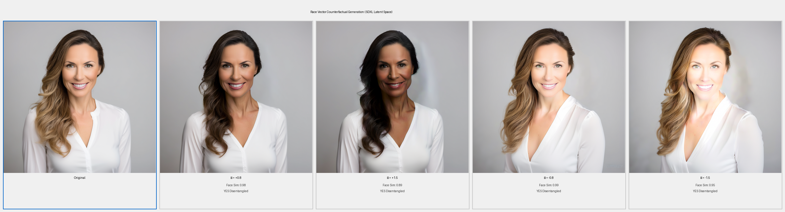

Identifies and isolates the linear direction encoding skin tone in the latent space of Stable Diffusion XL, then uses that vector to generate counterfactual portraits — images of the same person across a continuous skin-tone spectrum — while preserving identity, pose, and background.

---

## Results

| Base Portrait | Counterfactual Sweep (α = −1.5 → +1.5) |
|---|---|
|  |  |



**Quantitative results — all 4 counterfactuals pass every threshold:**

| α | Face Similarity ↑ | LPIPS ↓ | Background SSIM ↑ | Disentangled |
|---|---|---|---|---|
| +1.5 | 0.894 | 0.204 | 0.798 | ✓ |
| +0.8 | 0.977 | 0.134 | 0.864 | ✓ |
| −0.8 | 0.994 | 0.242 | 0.847 | ✓ |
| −1.5 | 0.954 | 0.280 | 0.821 | ✓ |

Thresholds: Face Similarity > 0.85 · LPIPS < 0.30 · Background SSIM > 0.75

---

## Key Technical Contributions

- **Latent-space vector extraction** — Computes a skin-tone direction via mean-difference of VAE-encoded portrait latents across two demographic groups; optionally refines it with a FaceNet-based identity-preservation loss.
- **Steered denoising** — Injects the race vector at every DDIM/DPM++ denoising step rather than adding it to the final latent. This keeps generations in-distribution and eliminates VAE decoding artifacts.
- **Spatial masking** — Applies a Gaussian face mask to the vector before injection, confining the edit to the face region and leaving background and hair largely unchanged.
- **Quantitative evaluation** — Measures disentanglement across five axes: face similarity (ArcFace), facial landmark RMSE, perceptual similarity (LPIPS), background SSIM, and 3D head pose drift.

---

## Tech Stack

`Python` · `PyTorch` · `Diffusers (SDXL)` · `scikit-learn` · `OpenCV` · `MediaPipe` · `FaceNet` · `LPIPS`

---

## Architecture

```
generate_training_data.py    # synthesise paired portrait groups via SDXL
run_race_vector_extraction.py  # end-to-end pipeline

src/
├── models/stable_diffusion.py      # SDXL wrapper — encode / decode / generate / steer
├── latent/
│   ├── vector_discovery.py         # race vector extraction + SVD decomposition
│   └── manipulator.py              # latent arithmetic, SLERP interpolation
├── metrics/
│   ├── identity_metrics.py         # face similarity, landmark RMSE, LPIPS
│   ├── structural_metrics.py       # background SSIM, 3D pose estimation
│   ├── disentanglement_metrics.py  # SAP, MIG, DCI scores
│   └── evaluator.py                # composite evaluation pipeline
└── visualization/
    └── grid_generator.py           # result grids and interactive HTML slider
```

---

## Quickstart

```bash
git clone https://github.com/Arnavsharma2/Isolating-Race-Vectors-in-Latent-Space.git
cd Isolating-Race-Vectors-in-Latent-Space
pip install -r requirements.txt

# Generate synthetic training portraits (16 total, ~10 min on GPU)
python3 generate_training_data.py

# Extract race vector, generate counterfactuals, evaluate
python3 run_race_vector_extraction.py
```

**Options:**

```bash
python3 run_race_vector_extraction.py \
  --steps 25 \          # denoising steps (DPM++ 2M Karras, default 25)
  --alphas -1.5 -0.8 0.8 1.5 \ # steering magnitudes
  --seed 999 \           # reproducibility seed
  --output experiments/results
```

Results are written to `experiments/results/`:

| File | Description |
|---|---|
| `base_image.png` | Unsteered base portrait |
| `counterfactuals_strip.png` | All alpha values in one strip |
| `final_grid.png` | Grid with per-image metric overlay |
| `counterfactuals/alpha_±N.N.png` | Individual steered images |
| `metadata.json` | Full reproducibility record |

---

## How It Works

**1. Vector extraction** — Portrait photos (or SDXL-generated portraits) for two skin-tone groups are encoded into SDXL's 4-channel latent space. The race vector is the mean latent difference between groups, weighted by a Gaussian spatial mask centred on the face. An optional optimisation step refines the vector to minimise FaceNet identity loss while maximising attribute change.

**2. Steered generation** — A base portrait is generated from a fixed seed and prompt. Counterfactuals are generated with the exact same seed but with the race vector injected at each denoising step via a `callback_on_step_end` hook. Because the denoiser sees the perturbation at every step, it converges to a coherent image in the steered direction rather than an out-of-distribution artefact.

**3. Evaluation** — Each (base, counterfactual) pair is scored on identity preservation, structural preservation, and an overall disentanglement pass/fail at a configurable threshold.

